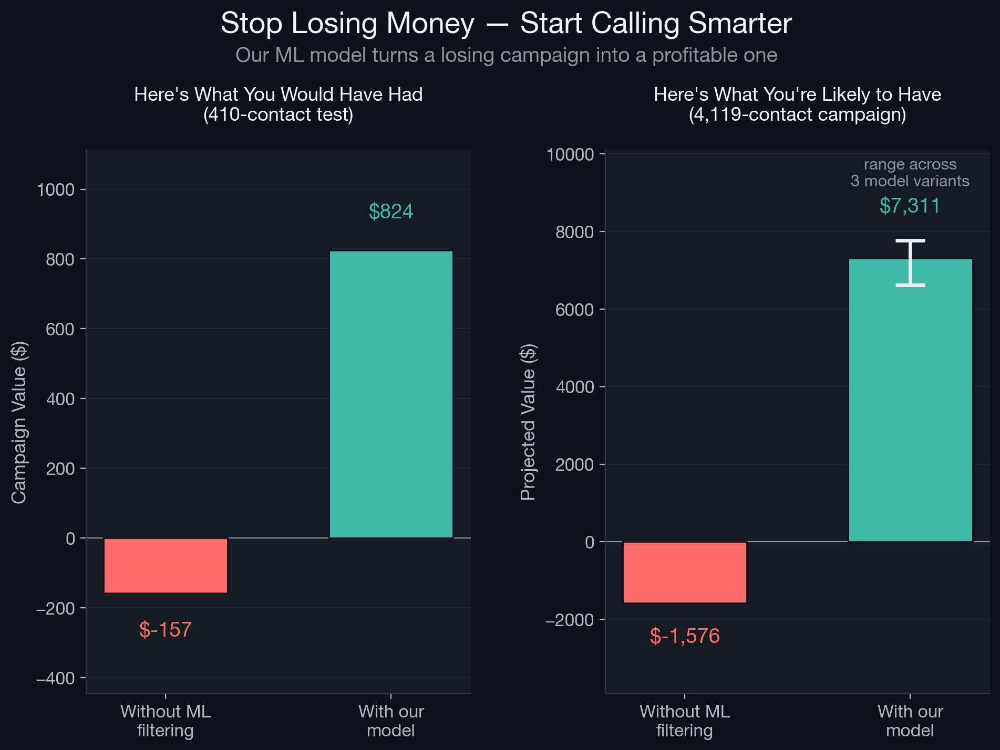
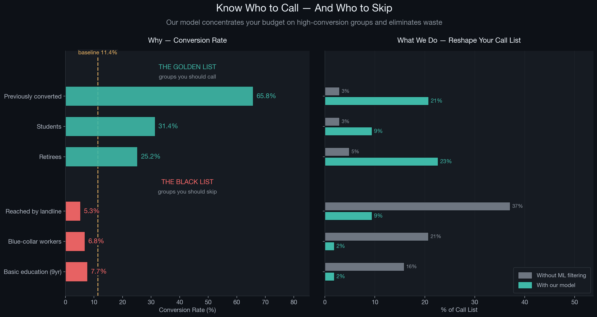

# CSE 450 - Machine Learning

Repository for **Team NorthWind's** coursework in CSE 450 Machine Learning at BYU-Idaho.

---

### Team Members

<table>
  <tr>
    <td align="center">
      <a href="https://github.com/CalebDilley">
        <br/>
        <sub><b>Caleb Dilley</b></sub>
      </a>
    </td>
    <td align="center">
      <a href="https://github.com/Dallin-Wagner">
        <br/>
        <sub><b>Dallin Wagner</b></sub>
      </a>
    </td>
    <td align="center">
      <a href="https://github.com/jonnboi13">
        <br/>
        <sub><b>Jonathan Oliphant</b></sub>
      </a>
    </td>
    <td align="center">
      <a href="https://github.com/nelsbuhrley">
        <br/>
        <sub><b>Nels Buhrley</b></sub>
      </a>
    </td>
  </tr>
</table>

---

## Module 2 - Bank Marketing Prediction

**Objective:** Predict which bank clients will subscribe to a term deposit, turning an unprofitable phone campaign into a profitable one.

We built three classifiers on the [UCI Bank Marketing dataset](https://archive.ics.uci.edu/ml/datasets/bank+marketing) (37k records, 11.4% positive rate). The core challenge is class imbalance -- a model that always says "no" scores 89% accuracy but generates zero revenue. We tackled this with **SMOTE oversampling**, **class weighting**, and **probability threshold tuning**, evaluating models on business value rather than accuracy.

| Model | Technique | Key Idea |
|-------|-----------|----------|
| RF + SMOTE | Random Forest | Synthetic oversampling + manual class weights |
| RF Balanced | Random Forest | Automatic balanced class weights |
| Stacking (RF + KNN) | Ensemble stacking | RF and KNN base learners feed a logistic regression meta-learner; threshold tuned to 0.61 |

### Highlights



- **Without ML filtering:** the campaign loses money ($-157 on 410 test contacts)
- **With our best model:** $824 profit on the same 410 contacts
- **Projected at scale (4,119 contacts):** up to $7,775 in campaign value



The models concentrate the call list on high-conversion groups (previously converted clients, students, retirees) and filter out low-yield contacts (landline-reached, blue-collar workers), boosting precision from 11.5% to 47.2%.

> Full technical writeup, per-model breakdowns, and detailed results in [`module_2-bank/README.md`](module_2-bank/README.md).

---

## Repository Structure

```
module_2-bank/       Bank marketing prediction project 
tools/               Shared utility scripts
notebooks/           Exploratory Jupyter notebooks
nels_b/              Nels's working directory
dallin_w/            Dallin's working directory
caleb_d/             Caleb's working directory
jonathan_o/          Jonathan's working directory
```