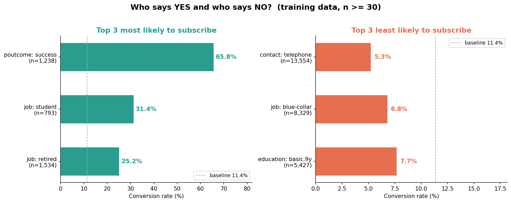
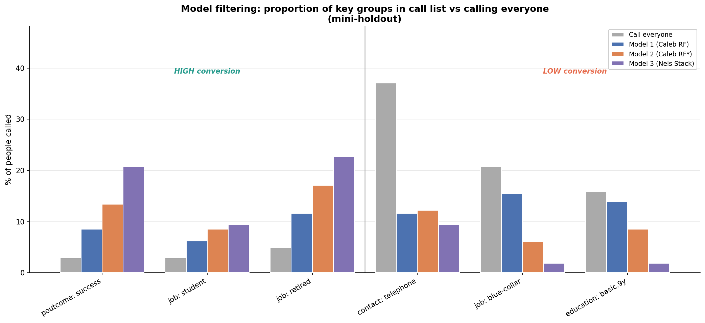
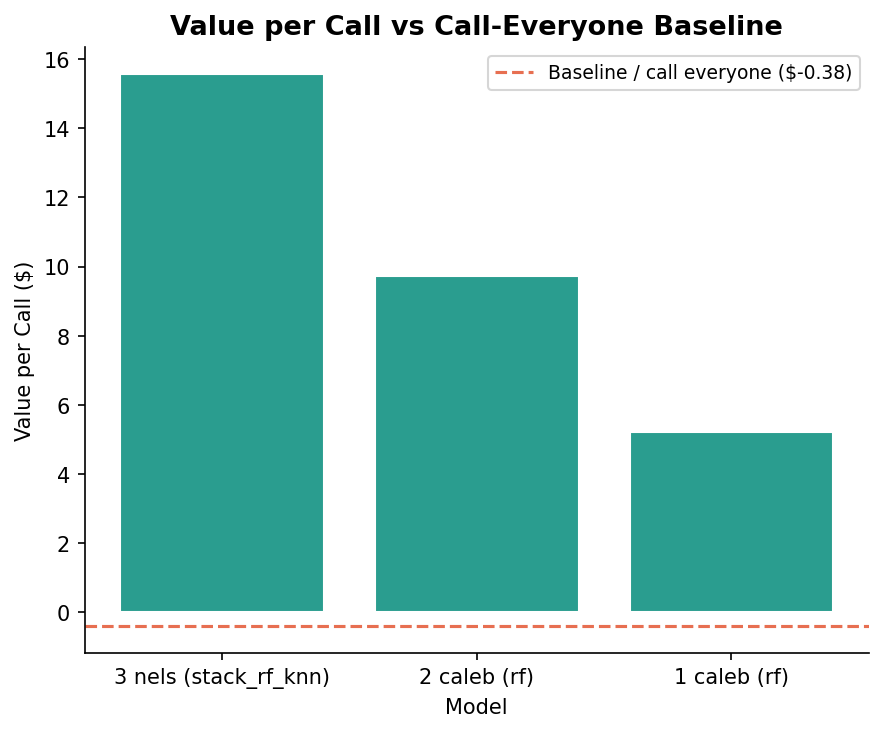
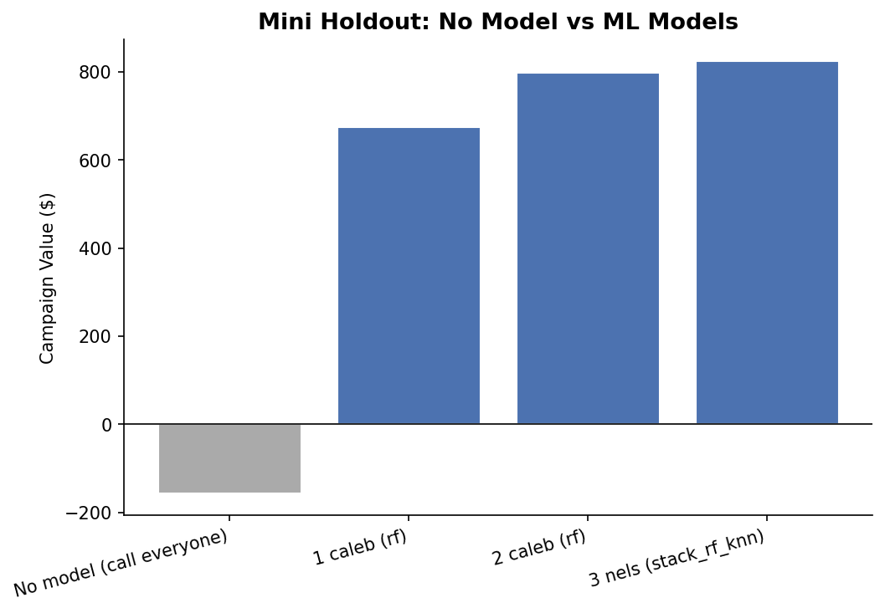
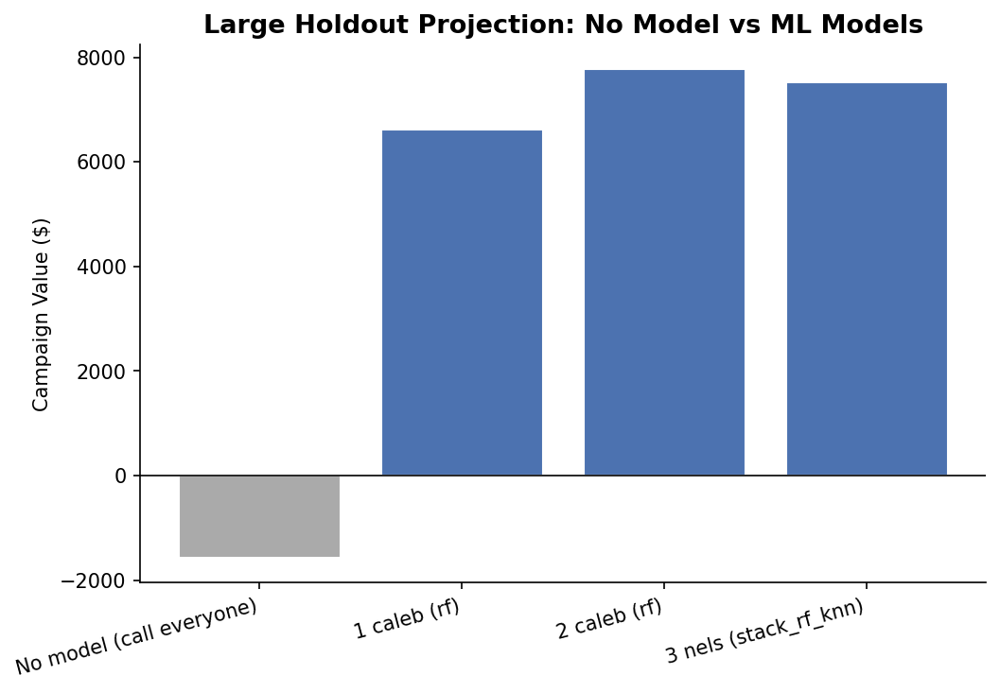

# Bank Marketing ML Analysis Report

## Group Profiles

Overall baseline conversion rate: **11.4%**

### Most likely to subscribe

| Group | Conversion Rate | Sample Size |
|-------|----------------:|------------:|
| poutcome: success | 65.8% | 1,238 |
| job: student | 31.4% | 793 |
| job: retired | 25.2% | 1,534 |

### Least likely to subscribe

| Group | Conversion Rate | Sample Size |
|-------|----------------:|------------:|
| contact: telephone | 5.3% | 13,554 |
| job: blue-collar | 6.8% | 8,329 |
| education: basic.9y | 7.7% | 5,427 |

### Model Filtering Effect

How much of each group ends up in the call list (mini-holdout):

| Group | Everyone | Model 1 (Caleb RF) | Model 2 (Caleb RF*) | Model 3 (Nels Stack) |
|-------|--------:|--------:|--------:|--------:|
| poutcome: success | 2.9% | 8.5% | 13.4% | 20.8% |
| job: student | 2.9% | 6.2% | 8.5% | 9.4% |
| job: retired | 4.9% | 11.6% | 17.1% | 22.6% |
| contact: telephone | 37.1% | 11.6% | 12.2% | 9.4% |
| job: blue-collar | 20.7% | 15.5% | 6.1% | 1.9% |
| education: basic.9y | 15.9% | 14.0% | 8.5% | 1.9% |

## Value per Call Analysis

Baseline (call everyone): **$-0.38/call** (47 TP, 363 FP)

| Model | Calls | TP | Value/Call | Lift over Baseline |
|-------|------:|---:|----------:|-------------------:|
| 3 nels (stack_rf_knn) | 53 | 25 | $15.56 | +$15.94 |
| 2 caleb (rf) | 82 | 28 | $9.74 | +$10.13 |
| 1 caleb (rf) | 129 | 31 | $5.23 | +$5.61 |

## Campaign Value Analysis

### 1. Historical Campaign (training data)

| Metric | Value |
|--------|-------|
| Total called | 37,069 |
| Subscribed | 4,208 |
| Conversion rate | 11.4% |
| Campaign value | $-16,034.38 |

### 2. Mini Holdout (answers known)

| Model | Calls | TP | FP | Precision | Value |
|-------|------:|---:|---:|----------:|------:|
| No model (call everyone) | 410 | 47 | 363 | 11.5% | $-156.92 |
| 1 caleb (rf) | 129 | 31 | 98 | 24.0% | $674.34 |
| 2 caleb (rf) | 82 | 28 | 54 | 34.1% | $798.92 |
| 3 nels (stack_rf_knn) | 53 | 25 | 28 | 47.2% | $824.50 |

### 3. Large Holdout Projection

| Model | Calls | TP (est) | FP (est) | Value (projected) |
|-------|------:|---------:|---------:|------------------:|
| No model (call everyone) | 4,119 | 472 | 3647 | $-1,576.47 |
| 1 caleb (rf) | 1,268 | 305 | 963 | $6,628.40 |
| 2 caleb (rf) | 798 | 272 | 526 | $7,774.86 |
| 3 nels (stack_rf_knn) | 484 | 228 | 256 | $7,529.40 |
